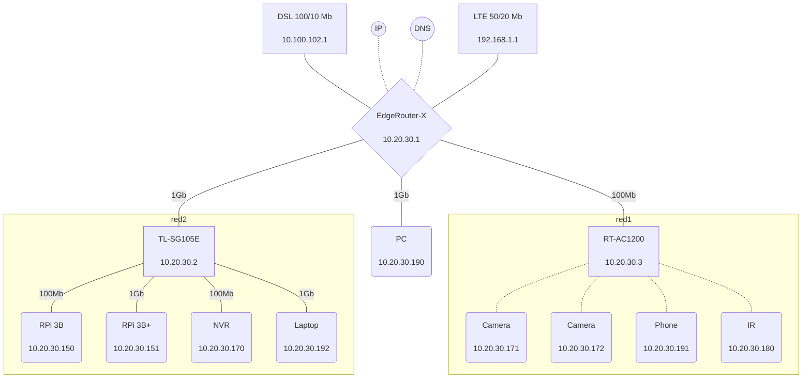

# Introduction to Disk Drive

Disk drives are devices that store and retrieve data on a computer. They come in various shapes, sizes, and technologies, depending on the purpose and performance they offer.

* Hard disk drives (HDDs) are the traditional type of disk drives that use spinning magnetic disks to store data. They have a high storage capacity and a low cost per gigabyte, but they also have some drawbacks. HDDs are prone to mechanical failures, noise, heat and power consumption. They also have a slower speed than other types of disk drives.
    * They come in 3.5" or 2.5" form factors
    * Forget these drives and concentrate on SSD for the entire course
* Solid state drives (SSDs) are a newer type of disk drives that use flash memory chips to store data. They have no moving parts, which makes them more reliable, quiet, cool and energy-efficient than HDDs. They also have a faster speed and a lower latency than HDDs.
    * They come in 3.5", 2.5", or 1.8" form factors
    * Flash memory is also solid-state storage (int the family of SSDs)

### Drive interface families
Disk drive interface which is part of the disk controller connects the disk drive to the computer with a physical connector. Disk drive interface provides a standard protocol for the hard disk drive to talk to the computer.
There are many types of disk drive interfaces including:

| Drive Interface Family | Host Communication Protocol              |
| ---------------------- | ---------------------------------------- |
| SATA, eSATA, mSATA     | AHCI (Default mode), IDE                 |
| SAS                    | iSCSI                                    |
| FC, FCoE               | FCP, iSCSI, NVMEoFC                      |
| PCIe NVMe              | NVMe, PCIe                               |

*Table 1: Different Disk Drive Interfaces and Protocols

#### SCSI and/or NVMe

Different Philosophies
* SCSI treats storage as devices
  * Tape drives, disk drives, scanners
  * Allows CPU to talk to devices via SCSI commands
  * Requires an adapter that “speaks” SCSI to translate CPU desires into device capabilities
  * Creates 1:1 relationship between host and storage
<figure>
  
  <figcaption>Figure 1: iSCSI</figcaption>
</figure>

* NVMe treats storage as memory
  * CPU can talk to memory natively
  * Extend semantics using PCIe
  * No adapter needed
  * Creates many-to-many relationship between host(s) and target(s)
  * NVMe defines a new simplified command set for storage
    * Simplified verbs (commands) reduce complexity

<figure>
  
  <figcaption>Figure 2: NVMe</figcaption>
</figure>

### Redundant Array of Independent Disks (RAID)

It’s better to have lot of little drives than one large drive from 2 aspects:
  * Speed
  * Data safety

When we combine to above aspects, we come up with different levels of RAID
  * RAID 0 (AKA stripe):
    * You need minimum of two drives
    * System doesn't see two drives
    * You double the read and write speed
    * Failure of one drive causes data loss
    * Total capacity Ctotal = n x C
      * For example if you have 2 drives of 1 TiB each, the total capacity would be 2 TiB
  * RAID 1 (AKA Mirroring):
    * You need minimum of two drives
    * System doesn't see two drives
    * Controller saves data pieces into two disks then in the 3rd disk controller calculate the parity piece and put that into that
    * Increased performance to Read and possible increased performance to Write
    * If you lose 1 drive data is recoverable, but if you lose 2 drives you lost everything
    * Total capacity Ctotal = 1 x C
      * For example if you have 2 drives of 1 TiB each, the total capacity would be still 1 TiB
  * RAID 5:
    * You need minimum of three drives
    * System doesn't see three drives
    * Controller saves data pieces into two disks then in the 3rd disk controller calculate the parity piece (XOR of the other two disks) and put that into that
    * Since both drives store exact same information, failure of one drive does not cause data loss
    * Total capacity Ctotal = (n-1) x C
      * For example if you have 3 drives of 1 TiB each, the total capacity would be still 2 TiB
  * RAID 10 (RAID 1 + 0):
    * RAID 10 is a stripe of mirrors
      * You make minumum two drives as RAID 1 which makes a set of mirror
      * Then you make another mirrir with another pair
      * Then, you stripe the two sets
   * You need minimum of four drives

#### Doing the RAID

  * Software RAID: telling the OS; overhead on the OS. In Windows: diskmgmt.msc; for software RAID, disk must be dynamic
  * Hardware RAID: we’re gonna have some type of controller (RAID Controller). It presents as an array to the OS itself
  * Firmware RAID: Take advantage of motherboard which has built-in functionality to setup RAID

#### What is JBOD

Just a Bunch Of Disks (JBOD) is not configured as a RAID
  * Spanned Volume
    * You won’t get speed and data safety

## Network Storage

  * DAS: Direct-Attached Storage is a storage connected directly to the server; just for file access in most cases; Small business solution: fast performance, simple, economical and efficient
  * NAS: Network-Attached Storage is a storage made available on the network:
    * May use SMB/CIFS (Microsoft Windows) or NFS (Unix/Linux)
    * File-based - transports only one byte of data at a time
    * Try: FreeNAS; Share access file
  * SAN: Storage Area Networking
    * Block level - transports an entire block of data
   
<figure>
  
  <figcaption>Figure 1: Network Storage Comparison</figcaption>
</figure>

### Storage Area Network (SAN)

SAN is a dedicated network that is scalable and highly available with the primary purpose of providing high-speed and low latency access to storage. SANs are typically implemented using Fibre Channel (FC). In a SAN architecture, storage devices are typically consolidated into a storage array, which is connected to a network of servers through a storage fabric. The storage fabric provides a high-speed interconnect between the servers and the storage devices, enabling high-performance access to data.

<figure>
  
  <figcaption>Figure 2: Storage Area Network</figcaption>
</figure>

#### Lugical Unit

The storage capacity if SAN storage array has to be shared among the hosts, so it is devided into logical disks assigned to the hosts. These logical disks appear to the host as local disks and are identified by a unique number called the logical unit number (LUN).

<figure>
  
  <figcaption>Figure 3: Lugical Unit</figcaption>
</figure>

## Fibre Channel Architecture

FibreChannel is a set of standards that enable high-speed data transfer between different devices. It is widely used in storage area networks (SANs) and other applications that require reliable and fast communication. FibreChannel can operate at speeds of up to 128 Gbit/s and support various topologies and protocols.
  * Channel is a peripheral input/output interface that allows direct error-free data transfer between the computer and the devices attach to it (in this cotext: disk)
  * Fibre Channel Protocol (FCP) is the serial SCSI command protocol used on Fibre Channel networks
  * FC replaces SCSI disk cable with a network
  * Protocol stack primary used to send SCSI commands over the SAN

#### Fibre Channel Terminologies
  * **Node:** Fibre Channel devices (server, storage) are called nodes
  * **Port:** A port is the interface in a node used for external communication. A node will have at least one port

### Components of FC SAN

The components of a FC SAN include:
  * Servers (Initiators)
  * Host bus adapters (HBA)
  * Cables
  * Storage Switches
  * Storage Array (Target)

#### Host bus adapters

An HBA is an I/O adapter in the form of PCIe expansion card or a component on the motherboard. They are like NIC cards frostorage network
  * Native FC HBA: SAN only
    * packet format: |FC|FCP|SCSI|
  * iSCSI HBA: LAN + iSCSI hardware offload; Data and Storage are both IPv4 or IPv6
    * packet format: |ETH|IP|TCP|SCSI|
  * FCoE CNA/VIC: LAN + FCoE hardware offload
    * Packet format: |ETH|FCOE|FCP|SCSI|	

#### Storage Switches

A fibre Channel switch is a device that provides central connection points for servers and Fibre Channel devices to communicate with each other.

* Cisco has supported FC and FCoE networking on previous Nexus families; Nexus 5000, Nexus 6000 and Nexus 7000.
  * N7K: Dedicated Storage VDC, Supports only FCoE
  * N5K: Support for FC, FCoE

* Today, Nexus 9000 products support FC and FCoE for both NX-OS and ACI modes.
  * All Nexus 9000 FC/FCoE switches only support NPV mode today, no native FC/FCoE switching
  * All FC Services (Zoning, Names Server, etc) reside on core FC/FCoE switch with NPIV enabled

* MDS: Support for FC, FCoE, FCIP
* Director: means bigger switch - more levels of redundancy

#### Storage

* Physical disk enclosures
* Configurations
  * JBOD
  * Storage Array
    * EMC2
    * NetApp
    * HP

### Fibre Channel Port Types

* N_Port - Node port
  * Available on the initiator and the target
  * Full duplex
  * In both P2P or SW fabric topologies
* F_Port - Fabric port
  * Switch's port that connects to a N_port
  * Logically equivalent to Access Port in Ethernet
* E_port - Expantion port
  * Connects a FC switch to another FC switch with a cabled called Inter-Switch Link (ISL)
  * Switches will run routing protocol (FSPF) between them on E_port
* TE_port
  * Analogous to dot1q
  * When running VSAN

### Types of Topologies

Fibre Channel architecture provides three topologies
  * Point-to-point
    * Dirrect connection between the initiator and the server

  * Arbitrated Loop
  * Switches Fabric

### Fibre Channel Addressing

Each entity in a Fibre Channel network is uniquely identified by a 64-bit address, called a Worl Wide Name (WWN).
  * WWNs are represented in hexadecimal pairs. Example: 21:00:00:e0:8b:05:05:04
  * Not used in Data Plane - Only in Control Plane - to figure out who is allowed to talk to who - like ACL
        * Zoning
  * Two types of WWNs   
    * WWNN or nWWN:
      * Assigned to network card
      * Uniquely identifies each device on the FC network
    * WWPN or pWWN: Assigned to physical port
      * Uniquely identifies each port in a device
      * This is important - You need this to manually create the boot policies of either UCS-C or B servers
      * Boot policy is like a static route - you don't know where the disk is, you need to program it in on the UCS servers
      * You also need pWWN in zoning
    

### FCoE
Most people assume FC and FCoE are either 1) totally different or 2) different enough that they cannot be intermixed. In reality, FC and FCoE are the same Fibre Channel protocols running on different physical media.
That means everything traditional FC offers (fabric services, zoning, etc) are identical between FC and FCoE

	FCID:  logical address - like IP
		3 bytes
		Assigned by switches by lldp
		 (Fiber-Channel Name Server)
			Domain ID: 1 Byte - equivalent to subnet - used for routing by FSPF (/8 is for routing)
				Can be manually assigned, otherwise automatically assigned--> principal switch assigns automatically as soon as you no shut the link
			Area ID: 1 Byte - unique for a group of ports
			Port ID: 1 Byte - unique per port
			
			show topology --> replaced show lldp
			
	Fibre Channel Routing
		Remember WWNs are not part of data plane -> no flood and learn
		FSPF is used to route traffic between switches
			Based on Domain ID part of FCID
		ECMP is supported for equal SPT branches
		No configuration required - but you can customize knobs
		
	Ethernet is Connectionless
	
	Fibre Channel networks are connection oriented
		All end stations must first register with control plane
		
	Fabric Registration has three parts
		FLOGI (Fabric Login)
			N_Port tells switch's Fabric F_Port it wants to register
			Switches learn WWNN and WWPN of Node
			The goal is to assign FCID to the node
			You can find this as a three-way handshake
			show flogi database
		PLOGI (Port Login)
			Like TCP 3-way handshake ; end to end between the initiator and target
			Used for apps such as e2e flow control
		PLRI (Process Login)
			Like SCSI registration - to read and write traffic
	
	Fiber-Channel Name Server (FCNS) process
		Equivalent to DHCP database/ARP cache
		Mapping between pWWNs and FCIDs
		Resolution of physical address to logical address
		No configuration required
		
		show fcns database
		show fcns database local

	Zoning:
		Like ACL
		Initiator X is allowed to talk to Target Y
		To ensure that the server don't write into wrong volume
		Resource consuming
		Zoning is a distributed fabric service
			Switches must agree on the zoneset before they can forward the traffic
			If zoneset merge fails, the port becomes disabled
			Common misconfiguration for troubleshooting
			Syslog is generated
			Zoning should be your very final step in FC configuration
			
	Virtual SANs (VSANs)
		Cisco-specific implementation
		To separate the storage networks
		Physical separation is costly
		E_ports now become TE_Ports
			Behind the scenes --> the switch runs multiple copies of routing
			Same logic as multiple separate OSPF processes
		
		VSAN is routing topology - link state flooding domain
			Separate FLOGI database
			Separate Zone set
			Separate …
			
	SAN Port Channeling
		Like Ethernet PortChannel
		The negotiation protocol is called PCP (logically like 802.3ad) - the configuration order is very finicky
			UCS FI supports only active mode
			First step: wwn the port
			Then Configure the PO
			Very last step: No shutdown the port
		Why?
			Otherwise the interface goes down and you might need to reboot the box.
			
		If you don't do port channel, you are routing equal cost
			Between switches you don't need PO
			End host can do default route one-way
				You need PO here at access layer
	----------------------------------------------------------------------
	VLAN ID is important for FCoE
	VSAN ID is important for native FC
	
